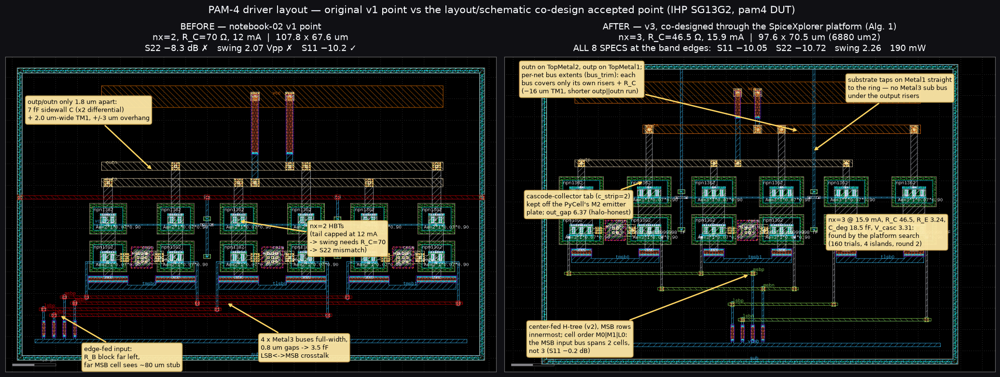
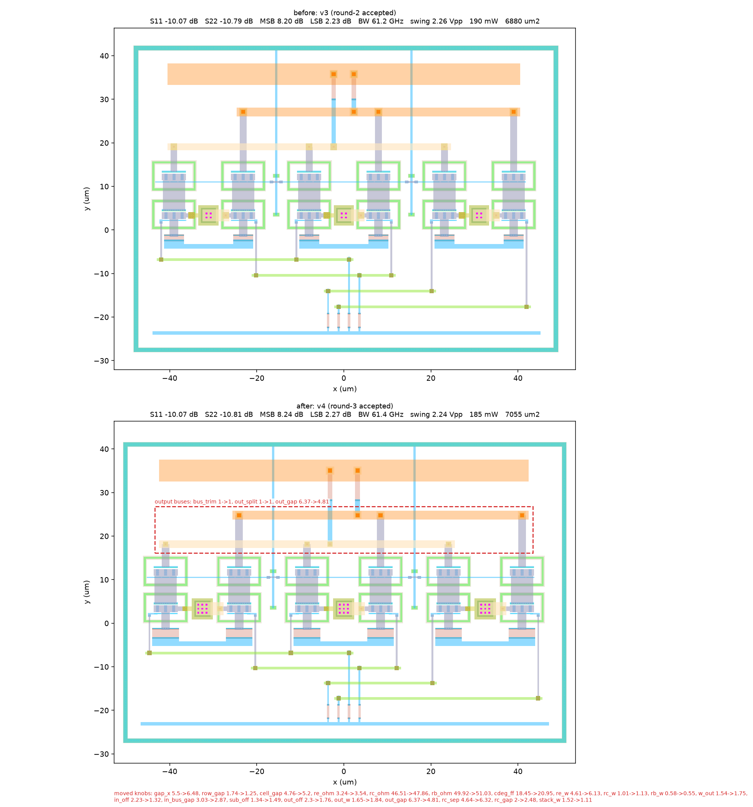
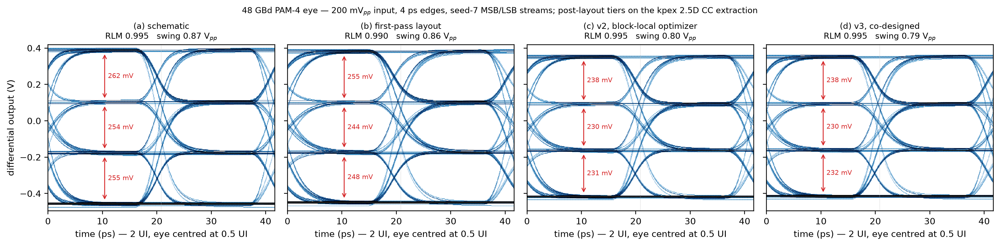
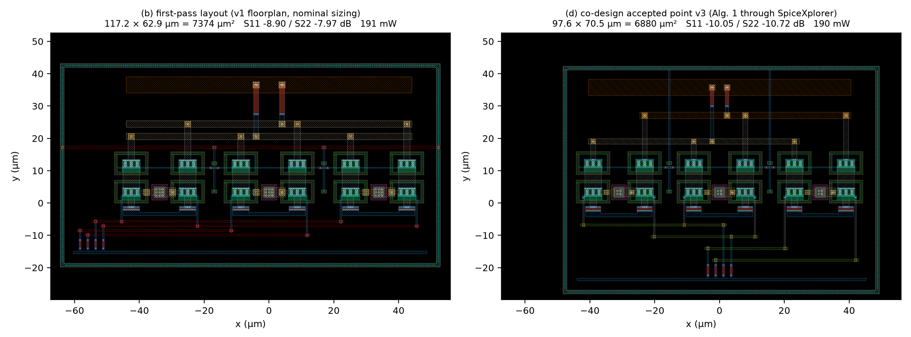
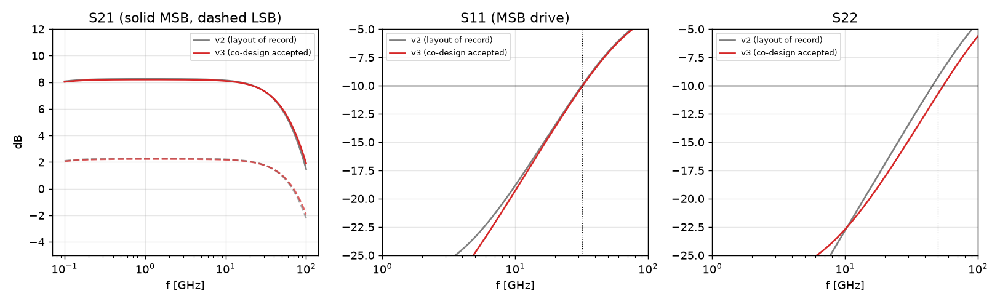
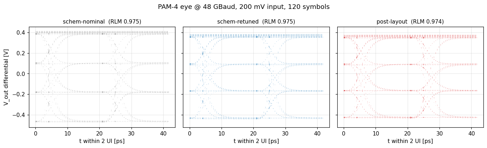
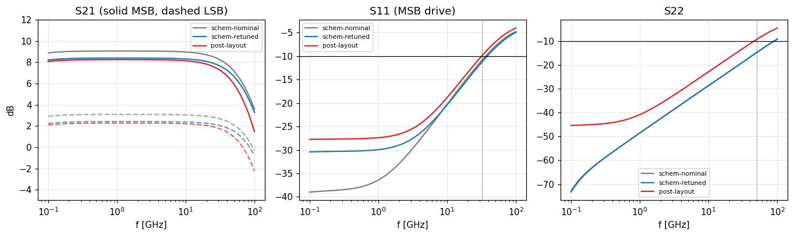
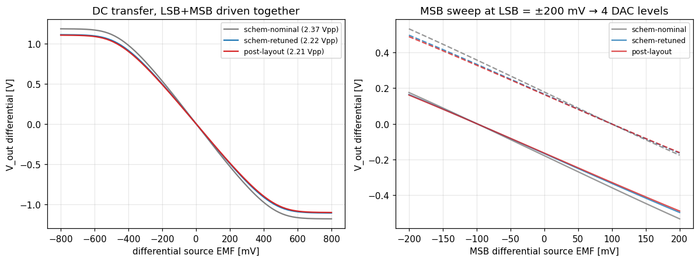
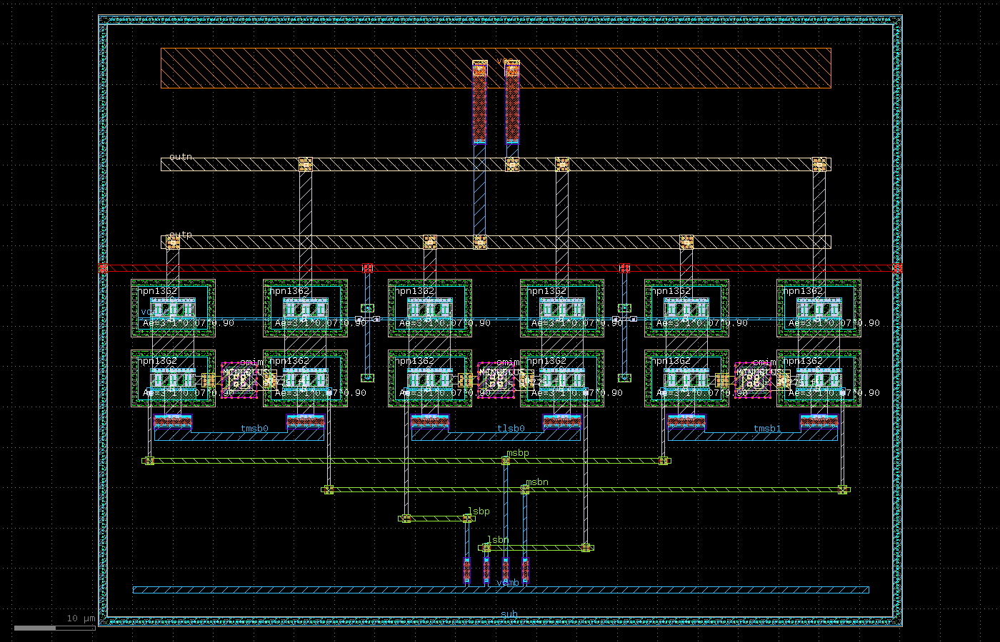

# Agentic design of a 96 Gb/s PAM-4 driver — IHP SG13G2 (130 nm SiGe BiCMOS)

AI-agent-driven, fully scripted design of an inductorless PAM-4 optical
modulator driver — a block-level replication of *Inac et al., "Inductorless
96 Gb/s PAM-4 Optical Modulators Driver in SiGe:C BiCMOS," EuMIC 2022* on
the open IHP SG13G2 PDK — taken from netlist to DRC/LVS-clean parameterized
layout, kpex extraction, and a layout + electrical co-optimization that
closes **all eight post-layout specs** — first with a block-local optimizer
(v2), then by running the paper's **layout/schematic co-design algorithm
through the SpiceXplorer platform** (`spicexplorer-optimize`,
`sim_engine: layout`; v3, the layout of record). The audit trail is four
notebooks plus a self-contained **reviewer report** ([`report/`](report/README.md):
schematic vs v1 / v2 / v3 layouts through the same benches, DRC/LVS/PEX
evidence, GDS + netlists, KLayout renders, eyes, tables — `make report`);
every result below reproduces from this repo.

## The layout journey

Original v1 layout (edge-fed input, 1.8 µm output-bus gap, nx=2 / R_C=70 Ω
electrical point) → the co-designed layout of record (v3):



The first optimization pass scored only S11/BW/gain/power — and its winner
(nx=2, R_C=70 Ω) sailed through those while silently **failing S22
(−8.3 dB) and output swing (2.07 Vpp)**, caught by the full signoff
(notebook 03). An expert RF layout review + a directed probe ladder
produced the v2 fix (`layout/before_after_v2.png` shows v1 → v2), and the
punchline: **once the layout was repaired, the electrical optimum returned to
the paper's nominal topology** (nx=3, R_C=50 Ω) — the odd v1 sizing had been
compensating layout parasitics.

| step | what was learned / changed | effect |
|---|---|---|
| v1 signoff | S22 and swing were never in the objective — R_C=70 bought gain with output mismatch | S22 −8.3 ✗, swing 2.07 ✗ |
| C-budget from extraction | output C, not R_C mismatch, limits S22: ~14 fF/side of bus wiring (kpex charges TM1 37 aF/µm of *edge* to substrate — length is everything) + ~14 fF/side cascode junctions; outp↔outn sidewall counts **double** differentially | fix must be geometric |
| output-network fixes | bus gap 1.8→8 µm, min-width TM1, slim risers/via stacks, ±1.5 µm overhang, compacted row | S22 −8.4 → **−10.14** at R_C=50 |
| input-network fixes | center-fed H-tree R_B (kills the far-MSB-cell ~80 µm stub), Metal4 buses with MSB rows innermost, 3 µm pair gap, Metal2 base drops | msb S11 at nx=3: −8.8 → −9.9 |
| electrical re-tune | tail 15 mA, R_B 48, V_casc 3.35, and **R_E 2.5→3.2 Ω** — series feedback shrinks the effective input C (the HBT model scales with Nx only) | S11 **−10.03** ✓ with gain 8.25 ✓ |
| verify | kpex RC mode ≡ CC mode to 0.01 dB; DRC + LVS clean on all 3 DUTs | point frozen as v2 (`gen_layout.V2_LAYOUT`) |

### v3 — co-design through the platform (2026-08-18)

Running the same loop *through* `spicexplorer-optimize` (Algorithm 1 of the
TCAS paper: agent owns the generator + bounds, platform owns the search,
DRC/LVS as gates; `layout/codesign/`) first fixed the **instrument** — the
v2 "−10.03 / −10.14" were the worst points of a `dec 20` grid that never
samples 32 / 50 GHz; at the band edges v2 reads **−9.94 / −9.24 dB and
fails both reflection specs** — and the extractor's 8 µm sidewall halo
(`out_gap` sat on it; now `pex.halo_um: 20`). Round 1 (120 trials) skipped
47 % of its budget on generator DRC bugs → three guards; round 2 turned the
layout review into five **structural INT knobs** (`bus_trim`, `sub_bus`,
`cell_order`, `c_strip`, `out_split`) and found the accepted point:



| | v2 (record) | **v3 accepted** |
|---|---|---|
| S11 @32 GHz / S22 @50 GHz | −9.94 / −9.24 dB ✗✗ | **−10.05 / −10.72 dB** ✅✅ (halo 20: −10.07 / −10.78) |
| gain LSB / MSB, BW, swing, power | 2.27 / 8.25 dB, 58.8 GHz, 2.21 Vpp, 179 mW | 2.23 / 8.21 dB, 61.1 GHz, 2.26 Vpp, 190 mW |
| core area | 7552 µm² | **6880 µm²** (−9 %; −39 % vs the paper's 11 300) |

Full story, rounds table, ceiling analysis and the annotated parameterized
layout: [layout/codesign/README.md](layout/codesign/README.md); notebook 04.

#### Where the co-optimization actually happens (the script to read)

The agent-generated layout (`layout/gen_layout.py`, a gdsfactory generator
whose `LayoutParams` are the knobs) and the schematic sizing were co-optimized
**by `spicexplorer-optimize`**, not by any loop in this repo. Everything the
platform needs is in **[`layout/codesign/`](layout/codesign/)** — three files:

| file | role in Alg. 1 |
|---|---|
| [`flow.yaml`](layout/codesign/flow.yaml) | `layout-flow/1`: *what one trial is* — `generator: ../gen_layout.py`, `cell`, KLayout DRC + LVS (per-trial reference from the generator), kpex 2.5D (`mode: CC`, MIM stripped, `halo_um: 20`), and the `measure:` hook; `gates: {drc, lvs, pex}` = the skip rule |
| [`project_setup.yaml`](layout/codesign/project_setup.yaml) | `sim_engine: layout`: *the search* — `dut_params` = θ_E ∪ θ_L ∪ θ_S with `init` = the layout of record (`seed_from_init`), `target_specs` = the eight signoff specs as feasibility bounds + S11/S22/area margins as the reward (`feasibility_reward` J), `ic_ma_per_finger` validity, DRC/LVS/PEX gates as `exact 1` specs |
| [`measure_post.py`](layout/codesign/measure_post.py) | the hook `measure(req) -> scalars`: kpex netlist → `pex_sim.convert_pex_netlist` (MIM re-inserted) → `wrap_layout_dut` → the block's own `driver_lib` benches (`run_ac`, `run_ac_s22`, `run_dc`, bias) with the trial's sizing + `deck_params` (tail, V_casc) → `s11, s22, msb_gain, lsb_gain, weight, bw, swing, power, ic_ma_per_finger` |

```yaml
# project_setup.yaml (excerpt) — one line per knob; the platform owns Opt.ask/tell
project:
  sim_engine: layout
  netlist: flow.yaml                     # the DUT "netlist" is the layout-flow spec
  dut_params:
    - { name: nx,       min_val: 2,   max_val: 4,    init: 3,    is_integer: true }   # θ_E (draws geometry)
    - { name: tail_ma,  min_val: 10.0, max_val: 17.5, init: 15.0 }                    # θ_E (bench-only -> deck_params)
    - { name: rc_ohm,   min_val: 40.0, max_val: 70.0, init: 50.0 }
    - { name: out_gap,  min_val: 3.0,  max_val: 20.0, init: 8.0 }                     # θ_L (um)
    - { name: bus_trim, min_val: 0,   max_val: 1,    init: 0,    is_integer: true }   # θ_S (round-2 structural option)
    # ... 33 knobs in all
  target_specs:
    - { name: s11, goal: minimize, target: -10.0, range: 5.0, weight: 10, reward_type: relative-absolute }
    - { name: s22, goal: minimize, target: -10.0, range: 5.0, weight: 10, reward_type: relative-absolute }
    - { name: msb_gain, goal: exceed, target: 8.2, range: 1.0, weight: 5, reward_type: none }
    # ... lsb_gain, weight, bw, swing, power, ic_ma_per_finger, drc_pass/lvs_match/pex_ok (exact 1)
  optimizer_config: { type: nevergrad, name: TwoPointsDE, seed_from_init: true }
```

One island of a round is one platform command (what `run_round.sh` /
`make codesign` wrap):

```sh
uv run --project ../../../../spicexplorer-platform spicexplorer-optimize \
    layout/codesign/project_setup.yaml --budget 40 --seed 0 --algo OnePlusOne \
    --outdir layout/codesign/runs/r2_s0
```

Every trial leaves `runs/<round>_s<seed>/layout/layout/run_<n>_layout/{pam4drv_pam4_lay.gds, drc/, lvs/, pex/, measure.log, summary.json}`;
`harvest.py` folds the islands into `results/<round>/{trials.jsonl,summary.json,best.*}` — the record R the agent reads
(and notebook 04 plots). The agent's part of the loop is only the diff of `gen_layout.py` and the bounds between rounds
(`rounds/r1_project_setup.yaml` → `project_setup.yaml`).

Open pre-tapeout items from the review (vcasc bypass/stability, EM current
density, ground cage, matching dummies) are tracked in
[layout/LAYOUT_REVIEW.md](layout/LAYOUT_REVIEW.md).

## Results

| metric (post-layout `pam4`, kpex 2.5D) | paper (meas.) | EIC ref (schem) | v2 (2026-08-09) | **v3 (layout of record)** | spec |
|---|---|---|---|---|---|
| LSB / MSB LF gain | 3.2 / 9.2 dB | 3.10 / 9.07 | 2.27 / 8.25 dB | **2.23 / 8.21 dB** | ≥ 2.2 / ≥ 8.2 ✅ |
| DAC weight | 6.0 dB | 5.97 | 5.98 dB | **5.97 dB** | ≥ 5.0 ✅ |
| Bandwidth (worst path) | 51–67 GHz | 68.5 | 58.8 GHz | **61.1 GHz** | ≥ 50 ✅ |
| S11 at 32 GHz | < −10 | −10.87 | −9.94 dB ✗ | **−10.05 dB** | ≤ −10 ✅ |
| S22 at 50 GHz | < −10 | −14.76 | −9.24 dB ✗ | **−10.72 dB** | ≤ −10 ✅ |
| Max diff swing | 2.1 Vpp | 2.92 | 2.21 Vpp | **2.26 Vpp** | ≥ 2.1 ✅ |
| Power | 192 mW | 191 | 179 mW @ 4 V | **190 mW @ 4 V** | ≤ 192 ✅ |
| 48 GBd PAM-4 eye (200 mV$_{pp}$ in) | Fig. 5 | RLM 0.995, 0.25 V eyes | RLM 0.995, 0.23 V eyes | **RLM 0.995, 0.23 V eyes** | open ✅ |
| Core area | 0.011 mm² | — | 0.0076 mm² | **0.0069 mm²** (97.6 × 70.5 µm) | — |

S11/S22 are the worst in-band values *including the interpolated 32 / 50 GHz
band edge* (kpex CC, tech halo 8 µm — the block's default instrument; the
v2 column is the record re-measured that way, see the v3 section above).
Eye metrics are read at the eye centre (`report/build_report.py`; the
notebooks sample at a fixed phase and read RLM ≈ 0.97). All four tiers —
schematic, first-pass layout, v2, v3 — side by side with the same instrument,
plus the p/n balance audit and per-tier DRC/LVS/PEX evidence, are in
[`report/`](report/README.md) (`report/data/tables.md`).
Both columns through the same `driver_lib` benches (notebook 04 §5):







**48 GBaud PAM-4 eye** — nominal schematic vs re-tuned schematic vs
parasitic-extracted layout, same testbench:



**S-parameters** (S21 both paths, S11, S22 — schematic vs post-layout):



**DC transfer + the four PAM-4 DAC levels** (swing/linearity signoff):



**Final pam4 layout** (3 differential cascode cells summing into shared
collector loads; DRC + LVS clean):



All plots regenerate from `notebooks/03_signoff.py`; the executed
notebooks (`.ipynb` built locally from the paired `.py`, `make notebooks`)
contain every table and figure inline:

| notebook | contents |
|---|---|
| [01_schematic_sizing](notebooks/01_schematic_sizing.py) | DUT schematics, testbenches, nominal sizing, bias/S-param/eye vs the verified reference |
| [02_layout_in_the_loop](notebooks/02_layout_in_the_loop.py) | gdsfactory generation, DRC/LVS, kpex, co-optimization with the **full 8-spec objective** |
| [03_signoff](notebooks/03_signoff.py) | DC/tran/AC/eye on schematic **and** post-layout through the *same* benches; master spec table; `emitter_width=0.07` validity proof |
| [04_codesign_platform](notebooks/04_codesign_platform.py) | the platform co-design record (`layout/codesign/results/`): per-round trial scatter / skip rates, round-by-round scorecard vs the honest baseline, moved knobs, annotated parameterized layout + before/after + rounds strip |

## Repo map

```
dut/          three DUT subcircuits (lsb / msb / pam4 2-bit DAC)
netlists/     static, directly runnable ngspice decks (+ .spiceinit)
testbenches/  driver_lib.py — netlist-agnostic benches (schematic AND
              post-layout via dut_ref=), run_verify.py, run_eye.py
layout/       gen_layout.py (parameterized generator, FINAL_LAYOUT = v3,
              V2_LAYOUT), signoff.py (DRC+LVS, vendored PDK runner),
              pex_sim.py (kpex), optimize_layout.py (block-local v1/v2 loop),
              LAYOUT_REVIEW.md, before_after.png (v1 -> v3; _v2 = v1 -> v2),
              codesign/ (Alg. 1 through spicexplorer-optimize: flow.yaml,
              project_setup.yaml, measure hook, rounds/, results/, figures),
              out/ (v3 netlists, PEX, renders; GDS regenerates)
report/       reviewer report — build_report.py, README.md, figs/, data/
              (tables + raw sweeps), layout/<tier>/ (GDS + LVS/kpex/post
              netlists + DRC/LVS logs), schematic/  (make report)
notebooks/    jupytext .py sources (+ locally built .ipynb) + report_figs/
results/      committed characterization plots + metrics YAML
schematics/   xschem schematics (paper Fig. 1 / 2a / 2b)
docs/         REFERENCE.md — detailed methods, measurement conventions,
              JPP-361 ngspice finding, provenance
```

## EDA tool setup

One-time, per machine. Install the tools wherever you like, then record the
paths in an untracked `local.mk` at the repo root — the Makefile injects
them into every flow.

1. **PDK** — clone [IHP-Open-PDK](https://github.com/IHP-GmbH/IHP-Open-PDK);
   `PDK_ROOT` = the directory containing `ihp-sg13g2`.
2. **ngspice 45** on `PATH` — build from
   [ngspice](https://ngspice.sourceforge.io) or use a distro package.
   Version 45+ is required for the full suite: on 44 the self-heating VBIC
   HBT fails `.op/.ac/.dc` (transient benches only — docs/REFERENCE.md).
3. **Python 3.11+** via [uv](https://docs.astral.sh/uv/): `uv sync` creates
   `.venv` from `uv.lock` (includes the `klayout` Python module the DRC/LVS
   runners use — no KLayout app install needed for signoff).
4. **klayout-pex ≥ 0.3.12** (*optional* — parasitic re-extraction only, see
   below): `pip install klayout-pex` in any env, or
   [releases](https://github.com/martinjankoehler/klayout-pex). Its LVS step
   additionally drives a **KLayout ≥ 0.30 executable** built with
   Ruby ≥ 2.6 ([klayout.de](https://www.klayout.de/build.html)). Both are
   found on `PATH` (`kpex`, `klayout`); override with `KPEX` /
   `KPEX_KLAYOUT_EXE` if they live elsewhere.

```make
# local.mk (untracked) — example
PDK_ROOT         = /opt/pdks
KPEX             = /opt/kpex/bin/kpex
KPEX_KLAYOUT_EXE = /opt/klayout/klayout
```

Ad-hoc runs outside `make` work the same way with environment variables:
`export PDK_ROOT=... PDK=ihp-sg13g2 [KPEX=... KPEX_KLAYOUT_EXE=...]`.

## Running it

```sh
make sync        # uv sync — create/update the Python env
make verify eye  # schematic benches + PAM-4 eye (results/*)
make signoff     # layout DRC + LVS on all three DUTs
make nb03        # execute the signoff notebook (jupytext -> .ipynb)
make report      # rebuild report/ (all tiers, DRC/LVS/PEX, benches, eyes)
```

`make all` runs everything (incl. notebooks 01/02; 02 is the
layout-in-the-loop optimizer — takes a while, tune with `NB_BUDGET=n`).
Any variable can also be set per-invocation, e.g.
`make signoff PDK_ROOT=/opt/pdks`. The `.ipynb` notebooks are generated
from the paired `.py` files and are not tracked.
A raw one-off deck: `cd netlists && ngspice -b tb_pam4_sparam_msb_1ghz.spice`.

Post-layout results reproduce **without kpex**: the converted PEX netlists
are committed (`layout/out/pex/dut_*_post.spice`) and every bench runs on
them via `run_ac(..., dut_ref=pex_sim.wrap_layout_dut("pam4", <netlist>))`.
The `.spiceinit` (`set ngbehavior=hsa`) is mandatory — without it the HBT
conducts 0 A silently; the Python runners write it automatically.

## Provenance

Port of the EIC-designer `lumped-broadband-driver` verified reference,
reproduced with zero delta on all 8 system metrics
(`results/pam4_results.yaml`). Designed, laid out, verified, and
re-optimized end-to-end by AI agents (Claude), including an independent
multi-agent RF layout review; the notebooks and `report/` are the
human-facing audit trail.
