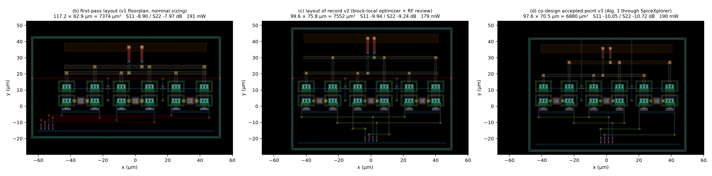
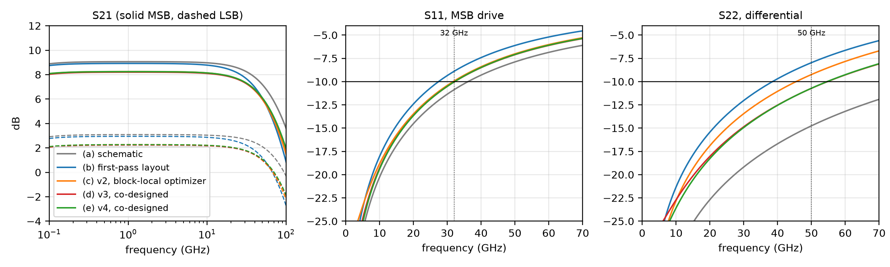
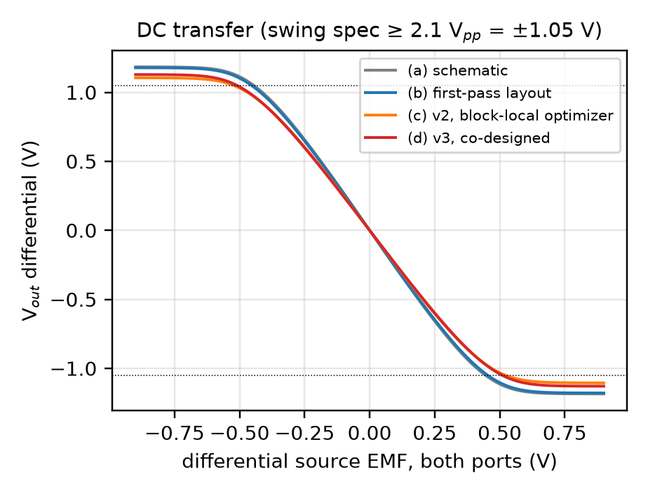
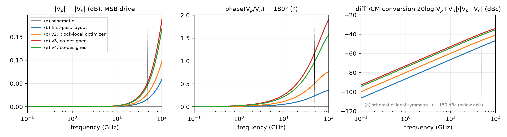

# Reviewer report — PAM-4 driver DAC (IHP SG13G2): schematic vs v1 / v2 / v3 layouts

Self-contained evidence package for the TCAS-2026 case study #2 (layout/schematic
co-design through the SpiceXplorer platform, paper Alg. 1). Everything here is
**regenerated by one command** — `make report` at the repo root — from the
committed generator (`layout/gen_layout.py`), the committed benches
(`testbenches/driver_lib.py`) and the committed measurement hook
(`layout/codesign/measure_post.py`); nothing is copied from older runs. Every
tier is rebuilt, re-signed-off (DRC + LVS), re-extracted (kpex 2.5D) and
re-simulated by the **same benches on the same instrument**, so the columns are
directly comparable.

Last build: 2026-08-18, research server (ngspice-45, KLayout 0.30.5, kpex,
IHP-Open-PDK sg13g2, gdsfactory + ihp-gdsfactory).

## The four tiers

| tier | what | where it comes from |
|---|---|---|
| (a) schematic | EIC-verified nominal sizing (nx=3, 16 mA/cell, R_C=R_B=50 Ω, R_E=2.5 Ω, C_deg=20 fF, V_casc=3.25 V), no layout | `dut/dut_pam4.spice` + `testbenches/driver_lib.CellParams()` |
| (b) first-pass layout | the ORIGINAL v1 floorplan (`LayoutParams()` defaults: edge-fed Metal3 input buses, 1.8 µm output-bus gap, full-width buses) with the nominal sizing of (a) | `layout/gen_layout.py` defaults |
| (c) v2, layout of record | block-local nevergrad loop + RF layout review, 2026-08-09 (`V2_LAYOUT` / `V2_BIASES`) | `layout/gen_layout.py`, `layout/README.md` v2 section |
| (d) v3, co-designed | accepted point of Alg. 1 run **through `spicexplorer-optimize`** (`sim_engine: layout`), round 2 island s3 trial 38 (`FINAL_LAYOUT` / `FINAL_BIASES`) | `layout/codesign/results/r2/`, `layout/codesign/README.md` |

Note on "v1": the repo's `layout/before_after.png` labels as *v1* the
notebook-02 optimum on this same first-pass floorplan (nx=2, R_C=70 Ω, 12 mA —
S22 −8.3 dB, swing 2.07 V$_{pp}$); the paper's column (b) and this report's tier
(b) use the first-pass floorplan with the **nominal** sizing so that (a)→(b)
isolates what the layout alone costs. Both are the same GDS floorplan.

## Instrument (identical for every column)

* **DRC**: KLayout `sg13g2_maximal` runset, `--no_density` (a 100 × 80 µm core has
  no density context); **LVS**: KLayout SG13G2 LVS against
  `dut_pam4_lvs.spice`, "Netlists match" required. Logs per tier in
  `layout/<tier>/signoff/`.
* **PEX**: kpex 2.5D, **CC** mode (coupling capacitances), tech default sidewall
  halo 8 µm — the block's default instrument. (`layout/out/pex/metrics_v3_*.json`
  shows halo 20 and RC mode for v3: −10.07 / −10.78, RC ≡ CC.) The converted
  post-layout netlist the benches run on is `layout/<tier>/dut_pam4_post.spice`.
* **S-parameters**: `.op` + ngspice's built-in S-parameter analysis (`sp dec 100`,
  ngspice-45; port sources `portnum`/`z0 50`, mixed-mode Sdd21 / Sdd11 / Sdd22
  over the p/n port pairs = 50 Ω/side, the paper's VNA convention; the legacy
  in-deck power-wave algebra agrees to all printed digits — `verification/`); the table
  quotes the **worst in-band value including the interpolated band edge**
  (32 GHz for S11, 50 GHz for S22 — `measure_post._band_max`) and the
  frequency to which −10 dB holds (`_edge`, interpolated). Older repo numbers
  read off the `dec 20` grid (last in-band points 31.62 / 44.67 GHz) are
  *not* used anywhere in this report.
* **Balance**: from the same 4-port S-matrix, MSB drive: the two output waves
  under differential drive (2·V_p = ½(S31−S32), 2·V_n = ½(S41−S42)) → |V_p|−|V_n|
  (dB), phase(V_p/V_n)−180°, and 20 log|V_p+V_n|/|V_p−V_n| (diff→CM conversion);
  worst value ≤ 48 GHz.
* **DC / swing**: `.dc` differential sweep, both ports driven in phase, ±0.9 V
  source EMF; swing = max−min of the differential output.
* **Power**: ramp-and-hold transient bias probe, mean |I(VCC)| × 4 V.
* **Eye**: 48 GBd PAM-4, 200 symbols (seed-7 independent MSB/LSB NRZ streams,
  200 mV$_{pp}$ input, 4 ps edges), differential output. Displayed as a
  persistence density (trace resampled to 20 fs, folded into 2 UI, eye centred
  at 0.5 UI); levels/openings clustered in a ±8 % UI window at the eye centre;
  RLM = 3·min(level spacing)/Σ(level spacings).

## Results — all tiers, one table

| metric | spec | paper meas. | (a) schematic | (b) first-pass layout | (c) v2, block-local optimizer | (d) v3, co-designed |
|---|---|---|---|---|---|---|
| gain LSB (dB) | ≥ 2.2 | 3.2 | 3.09 | 2.95 | 2.27 | 2.23 |
| gain MSB (dB) | ≥ 8.2 | 9.2 | 9.06 | 8.92 | 8.25 | 8.20 |
| DAC weight (dB) | ≥ 5.0 | 6.0 | 5.97 | 5.97 | 5.98 | 5.97 |
| BW MSB (GHz) | ≥ 50 | 51 | 66.6 | 51.6 | 58.8 | 61.1 |
| BW LSB (GHz) | ≥ 50 | >67 | 92.7 | 67.6 | 78.9 | 82.4 |
| S11 ≤ 32 GHz (dB) | ≤ −10 | <−10 | -10.87 | -8.90 | -9.94 | -10.05 |
| −10 dB edge S11 (GHz) | ≥ 32 | 32 | 36.1 | 27.4 | 31.7 | 32.2 |
| S22 ≤ 50 GHz (dB) | ≤ −10 | <−10 | -14.75 | -7.97 | -9.24 | -10.72 |
| −10 dB edge S22 (GHz) | ≥ 50 | 50 | 88.7 | 38.5 | 45.5 | 54.7 |
| swing diff (Vpp) | ≥ 2.1 | 2.1 | 2.37 | 2.36 | 2.21 | 2.26 |
| power @ 4 V (mW) | ≤ 192 | 192 | 191.0 | 191.0 | 179.1 | 190.2 |
| core area (µm²) | — | 11 300 | — | 7374 | 7552 | 6880 |
| p/n gain imbalance ≤ 48 GHz (dB) | audit | — | 0.00 | 0.02 | 0.03 | 0.05 |
| p/n phase imbalance ≤ 48 GHz (°) | audit | — | 0.0 | 0.2 | 0.5 | 1.2 |
| diff→CM conversion ≤ 48 GHz (dBc) | audit | — | < −150 (ideal symmetry) | -52.8 | -46.5 | -39.5 |
| I_C per emitter finger (mA) | < 3 (model card) | — | 2.67 | 2.67 | 2.50 | 2.65 |
| 48 GBd eye RLM | — | — | 0.995 | 0.990 | 0.995 | 0.995 |
| 48 GBd min eye opening (V) | — | — | 0.25 | 0.24 | 0.23 | 0.23 |
| 48 GBd output swing (Vpp) | — | — | 0.87 | 0.86 | 0.80 | 0.79 |

| tier | DRC (KLayout, --no_density) | LVS (KLayout) | kpex 2.5D | extracted elements (C / R) | wiring C outp / outn to gnd (fF) |
|---|---|---|---|---|---|
| (a) schematic | — (schematic) | — | — | — | — |
| (b) first-pass layout | PASS | PASS | CC, halo 8 µm | 135 / 0 | 14.8 / 15.5 |
| (c) v2, block-local optimizer | PASS | PASS | CC, halo 8 µm | 131 / 0 | 16.4 / 17.8 |
| (d) v3, co-designed | PASS | PASS | CC, halo 8 µm | 126 / 0 | 11.8 / 15.0 |

`data/metrics.json` / `metrics.csv` hold every scalar (incl. LSB/MSB S11
separately, edges, per-finger I_C, eye levels); `data/sparams_<tier>.csv`,
`balance_<tier>.csv`, `dc_<tier>.csv`, `eye_<tier>.npz` are the raw sweeps.

Reading the table:

* **(a)→(b)**: the first-pass floorplan with the paper's sizing loses both
  matches (S11 −8.90, S22 −7.97 dB) and 15 GHz of MSB bandwidth — the layout
  costs the specs, not the sizing.
* **(c)**: the block-local optimizer's layout of record *reads* −9.94 / −9.24 dB
  on this instrument (its own scorecard had claimed −10.03 / −10.14 off the
  `dec 20` grid) — it fails both reflection specs by the paper's definition.
* **(d)**: the platform co-design point meets all eight specs at the band edges
  (S11 −10.05 / S22 −10.72 dB, −10 dB holding to 32.2 / 54.7 GHz) in 6880 µm²
  (61 % of the reference silicon), at 190 mW. Margins are thin by design — S11
  is device-limited at ≈ −11.4 dB with zero input wiring, S22 floor −14.5 dB
  with zero output wiring (`layout/codesign/README.md`, "Ceiling").
* **Balance audit** (reviewer question on the asymmetric look of v3): the
  `out_split` option (outn on TopMetal2, outp on TopMetal1) makes the two
  output risers unequal — 11.8 / 15.0 fF wiring C to ground — which reads as
  0.05 dB / 1.2° / −39.5 dBc at 48 GHz (v2: 0.03 dB / 0.5° / −46.5 dBc). Both
  are far inside the ≤ 0.1 dB / ≤ 2° / ≤ −35 dBc audit specs now scored by
  round 3 (`layout/codesign/project_setup.yaml`); the eye (RLM, openings) does
  not resolve the difference.

### 48 GBd PAM-4 eye

| tier | levels (mV) | eye openings lo / mid / hi (mV) | RLM | swing (mV$_{pp}$) |
|---|---|---|---|---|
| (a) schematic, nominal sizing | -457, -176, +103, +387 | 255 / 254 / 262 | 0.995 | 875 |
| (b) first-pass layout (v1 floorplan, nominal sizing) | -449, -173, +101, +380 | 248 / 244 / 255 | 0.990 | 860 |
| (c) layout of record v2 (block-local optimizer + RF review) | -417, -162, +93, +351 | 231 / 230 / 238 | 0.995 | 797 |
| (d) co-design accepted point v3 (Alg. 1 through SpiceXplorer) | -415, -160, +93, +351 | 232 / 230 / 238 | 0.995 | 793 |


The eye swing here (~0.8 V$_{pp}$) is the small-signal 200 mV$_{pp}$ drive of
the paper's Fig. 5 test; the ≥ 2.1 V$_{pp}$ swing spec is the DC-transfer
saturation value (`fig_dc.png`).

### Layouts (KLayout's own render, `sg13g2.lyp` colours)

| tier | core W × H (µm) | area (µm²) | extracted C / R | wiring C outp / outn → gnd (fF) |
|---|---|---|---|---|
| (b) first-pass layout (v1 floorplan, nominal sizing) | 117.2 × 62.9 | 7374 | 135 / 0 | 14.8 / 15.5 |
| (c) layout of record v2 (block-local optimizer + RF review) | 99.6 × 75.8 | 7552 | 131 / 0 | 16.4 / 17.8 |
| (d) co-design accepted point v3 (Alg. 1 through SpiceXplorer) | 97.6 × 70.5 | 6880 | 126 / 0 | 11.8 / 15.0 |



`figs/fig_layout_b_vs_d.*` is the two-panel first-pass vs co-designed
comparison; `figs/fig_layout_annotated.*` is (d) with **every optimizer knob
of `project_setup.yaml`** drawn from the generator's own geometry record on the
KLayout render (white = layout µm knobs, red = electrical sizing that draws
geometry, blue = structural options).

### S-parameters, DC transfer, balance





## What is where

```
report/
  README.md                this file
  build_report.py          the generator of everything below (make report)
  data/
    tables.md              the two tables above (auto-written)
    metrics.json/.csv      every scalar, every tier
    sparams_<t>.csv        f_ghz, s21_msb_db, s21_lsb_db, s11_msb_db, s11_lsb_db, s22_db
    balance_<t>.csv        f_ghz, gain_imb_db, phase_imb_deg, cm_leak_dbc
    dc_<t>.csv             vd_source_v, vout_diff_v
    eye_<t>.npz            t, v (differential output), t0_ns, baud
  figs/                    fig_eye, fig_sparams, fig_dc, fig_balance, fig_layouts,
                           fig_layout_b_vs_d, fig_layout_annotated  (PNG + PDF)
  layout/<b|c|d>/
    dut_pam4.gds           the DRC/LVS-clean GDS of that tier (regenerable byte-for-byte)
    dut_pam4_lvs.spice     LVS reference netlist (PDK primitives)
    dut_pam4_kpex.spice    kpex input schematic
    dut_pam4_post.spice    converted post-layout netlist the benches ran on
    dut_pam4_sim.spice     pre-layout sim netlist at that tier's sizing
    layout_params.json     LayoutParams of the tier; bench_biases.json (vcc, vcasc, vcmb, tail)
    signoff/drc, signoff/lvs   KLayout run logs (+ LVS extracted netlist)
    layout.png             KLayout render
  schematic/
    dut_{lsb,msb,pam4}.spice        the DUT netlists (authoritative)
    dut_*.sch/.svg/.png              xschem schematics (dut_pam4_flat.sch = connectivity-true sheet)
    pam4_{architecture,lsb,msb}_vector.pdf   the paper's vector schematics
  work/                    scratch (git-ignored)
```

**Verify by hand:** every number in the tables above has a static ngspice
deck in [`../verification/decks/<tier>/`](../verification/README.md) and a
one-command checker (`make verify-report`) that re-runs it and compares with
`verification/expected.json` (= `data/metrics.json` frozen).

Regenerate: `make report` (≈ 15 min: three builds + DRC/LVS/kpex + all
benches + 4 parallel eyes); `make report REPORT_ARGS='--skip-build --reuse-eye'`
re-plots and re-tabulates from `work/` and `data/` in ~1.5 min. Tier sizing
lives only in `build_report.py::TIERS` (which points at `gen_layout` constants).
